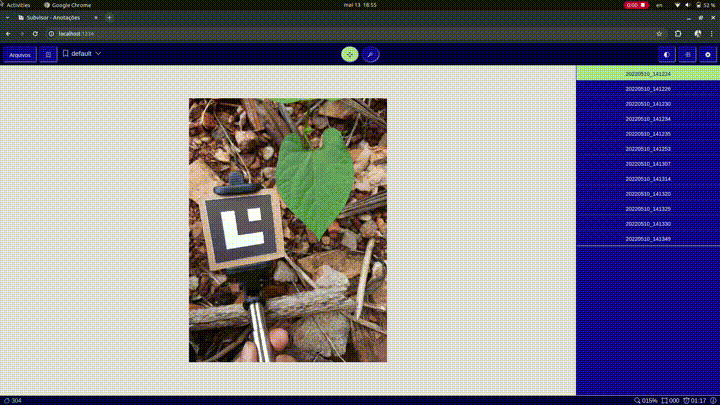
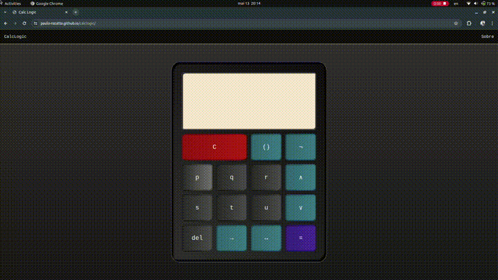
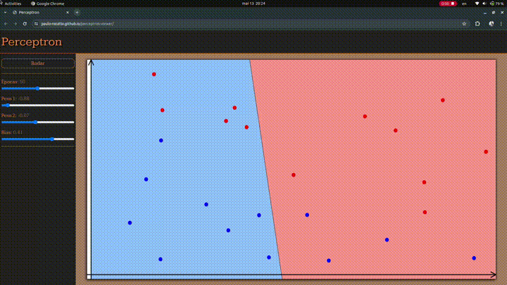
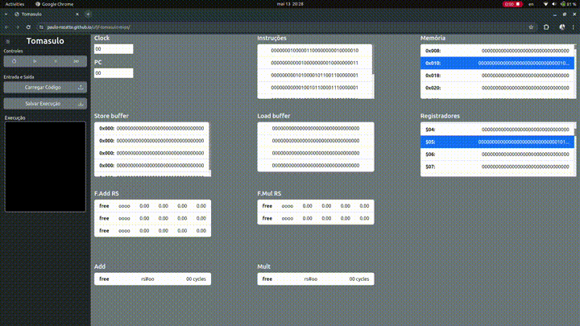

# Paulo Rozatto

<b>Final-year Computer Science student and Computer Vision enthusiast.</b>

 

## A Few Projects

| **Subvisor:** AI powered image annotation tool |
|:--:|
|  |

| Calclogic | Perceptron Viewer | Tomasulo MIPS |
|:--:|:--:|:--:|
|  |  |  

