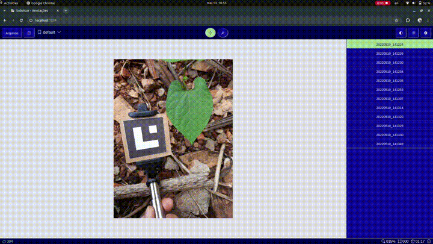
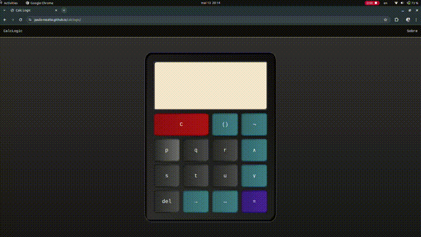
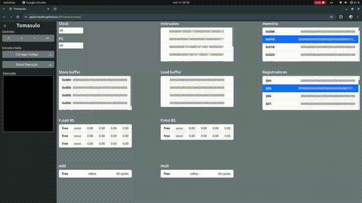
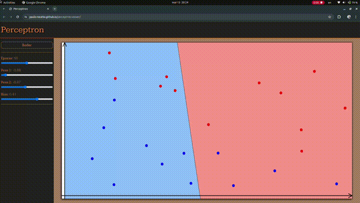

# Hi there, I'm Paulo Rozatto 👋

**R&D Engineer @ dtLabs | MSc Student in Computer Science @ PPGCC UFJF**

I am a researcher and software developer passionate about bridging the gap between theoretical machine learning and practical software engineering. Currently pursuing my Master's degree at the Federal University of Juiz de Fora (UFJF), my academic research focuses on **Computer Vision, Deep Learning, and Remote Sensing**. 

---

## 🔬 Research & Publications

### 1. Soft Routing-Inspired Specialization for Efficient Satellite Image Time Series Segmentation

> *Published in ICCSA 2026*

As the main focus of my current research, this paper introduces a soft routing-inspired specialization into the Exchanger architecture. By adapting soft Mixture-of-Experts (MoE) principles, we successfully maintain state-of-the-art performance while significantly reducing computational resources, cutting FLOPs by up to 30% and lowering latency, for large-scale satellite image time series (SITS) segmentation.
- [🔗 Code Repository](https://github.com/Paulo-Rozatto/exchanger-soft-routing)

  

### 2. Development of an Artificial Intelligence-Aided Software for Annotating Image Datasets

> *Published in SBSI 2025*

This paper introduces **Subvisor**, an AI-powered image annotation tool designed to accelerate the creation of computer vision datasets. 
- [🔗 Subvisor Repository](https://github.com/Paulo-Rozatto/subvisor)

  

### 3. A Computer Vision-based Architecture for Remote Physical Rehabilitation

> *Published in Journal of Mobile Multimedia (2024)*

We proposed a software architecture that utilizes computer vision to assist in the remote diagnosis and treatment of physical rehabilitation patients. The system tracks prescribed exercises and provides visual guidance to ensure patients execute them properly from home.
- [📄 Read the Paper](https://doi.org/10.13052/jmm1550-4646.2045)

---

## 💻 Side Projects

While my day-to-day involves training deep neural networks, I love diving deep into computer science fundamentals. Here are a few projects I built to explore lower-level concepts:

| **Calclogic** | **Tomasulo MIPS** | **Perceptron Viewer** |
|:---:|:---:|:---:|
|  |  |  |
| **Logic + Compiler Front-End** Styled with CSS to look like a standard calculator, but powered by an SLR parser under the hood to evaluate logic expressions and generate truth tables. | **Computer Architecture** Simulates out-of-order instruction execution for a subset of the MIPS architecture using Tomasulo's algorithm. | **Machine Learning Basics** A 2D visualizer demonstrating the original single-layer perceptron learning rule in real-time. |

